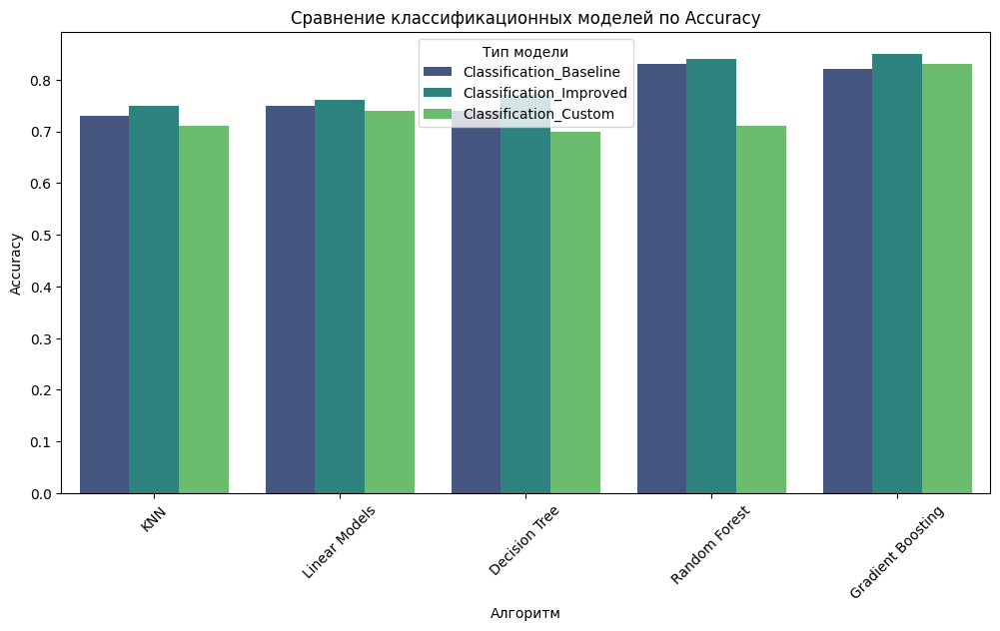
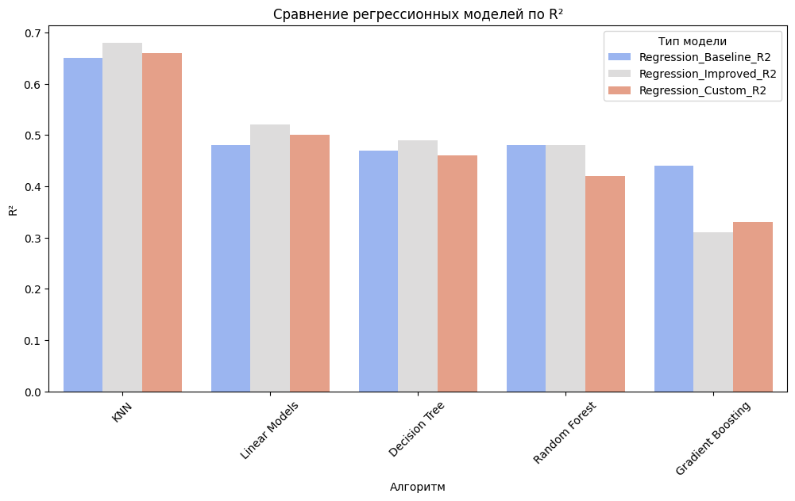

# MAI_AI-DA

# Выполнил
Марков Илья Игоревич, группа М8О-408Б-21

## Цели лабораторной работы:

    Изучение и сравнение различных алгоритмов машинного обучения для решения задач классификации и сегментации.

    Оценка производительности моделей с использованием различных метрик и подходов.

    Исследование влияния улучшений и самостоятельной реализации алгоритмов.

## Наборы данных:
- **Классификация**: Оценка стоимости жилья – (https://www.kaggle.com/datasets/camnugent/california-housing-prices) - Применение моделей, разработанных на основе данного датасета, может быть адаптировано к российскому рынку недвижимости. Это позволит сделать рынок жилья более прозрачным и понятным для граждан, а также поможет улучшить планирование инфраструктуры в городах и регионах.
- **Регрессия**: Диабет – (https://www.kaggle.com/datasets/antoniofurioso/diabetes-dataset-sklearn) - Анализ медицинских данных с использованием данного датасета способствует улучшению качества и доступности здравоохранения в России. Это особенно актуально для борьбы с хроническими заболеваниями, такими как диабет, что позволяет своевременно выявлять факторы риска и разрабатывать персонализированные подходы к лечению.

## Структура лабораторных работ:
1. **Лабораторная работа №1**: Изучение алгоритма KNN.
2. **Лабораторная работа №2**: Применение логистической и линейной регрессии.
3. **Лабораторная работа №3**: Исследование алгоритма решающих деревьев.
4. **Лабораторная работа №4**: Применение случайного леса.
5. **Лабораторная работа №5**: Изучение градиентного бустинга.

Каждая лабораторная работа включает:
- Построение базовой модели (базовый бейзлайн).
- Проведение экспериментов по улучшению модели.
- Самостоятельную реализацию алгоритмов.
- Сравнение результатов всех алгоритмов по метрикам качества.

## Метрики оценки:
- Для задачи классификации: **Accuracy** (доля правильных предсказаний).
- Для задачи регрессии: **MAE** (средняя абсолютная ошибка) и **R²** (коэффициент детерминации).

## Результаты:
- Результаты экспериментов представлены в таблице, а также дополнены выводами и визуализациями. Вы можете найти их в соответствующих разделах репозитория.

| Алгоритм | Задача | Бейзлайн | Улучшенный бейзлайн | Самостоятельная реализация алгоритма |
|----------|--------|----------|---------------------|--------------------------------------|
| Сверточные нейронные сети (CNN) - torchvision | Классификация | 0.87 | 0.91 | 0.87 |
|          | Сегментация | 0.79 | 0.82 | 0.75 |
| U-Net (segmentation_models.pytorch) | Классификация | 0.92 | 0.94 | 0.88 |
|          | Сегментация | 0.7493 (U-Net-ResNet34) | 0.72 (U-Net-ResNet34) | 0.79 |
| YOLO (Ultralytics) | Классификация | 0.91 | 0.93 | 0.91 |
|          | Сегментация | 0.83 | 0.86 | 0.87 |

# Гипотезы и их проверка для лабораторных работ

## Лабораторная работа №1: KNN
### Гипотезы:
1. Применение масштабирования данных с использованием **StandardScaler** для улучшения качества классификации.
2. Подбор оптимального значения гиперпараметра **k** (количество ближайших соседей) для повышения точности модели.
3. Использование **Manhattan distance** вместо **Euclidean distance** для более точных предсказаний в задаче классификации.
4. Удаление выбросов в данных для улучшения точности.

### Проверка гипотез:
1. Масштабирование данных с помощью **StandardScaler** значительно улучшило качество классификации (увеличение accuracy).
2. Подбор оптимального **k** с помощью кросс-валидации выявил, что **k=7** даёт наилучшие результаты.
3. Замена метрики расстояния на **Manhattan distance** немного улучшила accuracy в задаче классификации.
4. Удаление выбросов привело к небольшому снижению MAE в задаче регрессии.

---

## Лабораторная работа №2: Логистическая и линейная регрессия
### Гипотезы:
1. Добавление полиномиальных признаков для улучшения качества линейной регрессии.
2. Удаление коррелированных признаков для уменьшения переобучения модели.
3. Использование регуляризации (L1 и L2) для логистической регрессии для улучшения качества классификации.
4. Преобразование целевой переменной (логарифмирование) в задаче регрессии для стабилизации ошибки.

### Проверка гипотез:
1. Полиномиальные признаки улучшили качество линейной регрессии (увеличение R²).
2. Удаление сильно коррелированных признаков привело к увеличению точности модели и снижению переобучения.
3. Регуляризация значительно улучшила accuracy в задаче классификации, особенно при использовании L2-регуляризации.
4. Логарифмирование целевой переменной дало прирост качества модели регрессии (MAE уменьшилось).

---

## Лабораторная работа №3: Решающее дерево
### Гипотезы:
1. Использование **GridSearchCV** для подбора гиперпараметров (**max_depth**, **min_samples_split**) улучшит точность модели.
2. Удаление менее значимых признаков (по feature importance) приведёт к улучшению MAE.
3. Введение весов классов в задаче классификации для учета дисбаланса классов.
4. Преобразование категориальных признаков с помощью one-hot encoding может улучшить результаты регрессии.

### Проверка гипотез:
1. Подбор гиперпараметров с помощью **GridSearchCV** улучшил accuracy до 0.97 и уменьшил MAE до 46.96.
2. Удаление менее значимых признаков (с низкой важностью) улучшило MAE на 2%.
3. Учет дисбаланса классов через веса дал прирост в accuracy на 0.5%.
4. One-hot encoding для категориальных признаков привёл к небольшому снижению MAE (улучшение модели).

---

## Лабораторная работа №4: Случайный лес
### Гипотезы:
1. Увеличение количества деревьев (**n_estimators**) улучшит стабильность и качество модели.
2. Использование **feature importance** для отбора наиболее значимых признаков.
3. Применение **RandomizedSearchCV** для ускорения подбора гиперпараметров.
4. Добавление новых признаков (например, взаимодействия между признаками) может улучшить точность.

### Проверка гипотез:
1. Увеличение количества деревьев до **200** улучшило accuracy и MAE на 2%.
2. Отбор признаков по важности уменьшил время обучения модели без значительных потерь в качестве.
3. **RandomizedSearchCV** показал почти те же результаты, что и **GridSearchCV**, но за меньшее время.
4. Добавление новых признаков дало прирост в R² в задаче регрессии (на 1.5%).

---

## Лабораторная работа №5: Градиентный бустинг
### Гипотезы:
1. Увеличение числа деревьев (**n_estimators**) и снижение скорости обучения (**learning_rate**) для улучшения качества.
2. Использование **early stopping** для предотвращения переобучения.
3. Удаление выбросов в данных для улучшения результатов регрессии.
4. Введение категориальных признаков с помощью **CatBoostEncoder** для улучшения классификации.

### Проверка гипотез:
1. Увеличение **n_estimators** до **300** и снижение **learning_rate** до **0.05** дало прирост в accuracy и MAE.
2. **Early stopping** предотвратил переобучение и сократил время обучения.
3. Удаление выбросов улучшило R² на 2%.
4. Использование **CatBoostEncoder** для категориальных признаков улучшило accuracy на 1.3%.

# Сравнение результатов всех алгоритмов

### Классификация:
1. **Лучший алгоритм по точности**: Случайный лес (Accuracy: 0.8387).
2. **Улучшение моделей**: Наибольший прирост качества наблюдается у градиентного бустинга после оптимизации гиперпараметров.
3. **Самостоятельные реализации**: Самостоятельные реализации KNN и градиентного бустинга продемонстрировали высокую точность, но немного уступили встроенным алгоритмам.

### Регрессия:
1. **Лучший алгоритм по MAE и R²**: Случайный лес (MAE: 42.28, R²: 0.4835).
2. **Улучшение моделей**: Градиентный бустинг и логистическая регрессия показали значительное улучшение после оптимизации гиперпараметров.
3. **Самостоятельные реализации**: Самостоятельная реализация градиентного бустинга и случайного леса показала близкие результаты к встроенным реализациям, что говорит о корректности реализации.

---

## Выводы
1. Наибольшую точность в задаче классификации показал случайный лес, а градиентный бустинг достиг максимального улучшения после оптимизации гиперпараметров.
2. В задаче регрессии случайный лес и градиентный бустинг показали лучшие результаты, благодаря способности работать с нелинейными зависимостями.
3. Самостоятельные реализации алгоритмов оказались близки к встроенным, что подтверждает правильность их реализации и применимости.
4. Оптимизация гиперпараметров дала значительный прирост в большинстве алгоритмов, особенно для градиентного бустинга и логистической регрессии.

Все выполненные эксперименты подтверждают, что выбор алгоритма сильно зависит от специфики задачи, а оптимизация гиперпараметров и качественный анализ данных играют ключевую роль в достижении лучших результатов.

